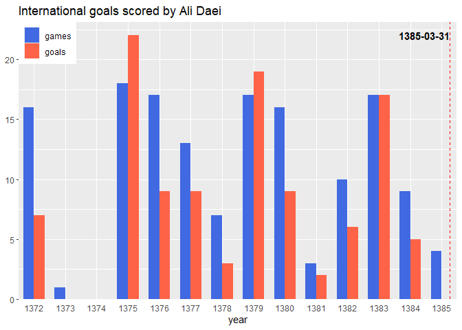

<!-- README.md is generated from README.Rmd. Please edit that file -->

# ggsh

<!-- badges: start -->
<!-- badges: end -->

## Overview

`ggsh` is an R package that extends `ggplot2` by providing date/time
scales based on Jalali calendar. `ggsh` uses classes provided by the
[shide](https://github.com/mmollayi/shide/) package for mapping
aesthetics to date/time types.

## Installation

You can install the development version of `ggsh` from
[GitHub](https://github.com/) with:

``` r
# install.packages("devtools")
devtools::install_github("mmollayi/ggsh")
```

## Example

Use `scale_x_jdate()` the same way you would use `scale_x_date()`.

``` r
library(ggsh)
library(shide)
library(ggplot2)
library(dplyr)
library(tidyr)

last_match <- max(daei_caps$date)
daei_caps |>
    dplyr::mutate(date = shide::sh_floor(date, "year")) |>
    dplyr::group_by(date) |>
    dplyr::summarise(across(goals, sum), games = dplyr::n()) |>
    tidyr::pivot_longer(c(goals, games), names_to = "stat") |>
    ggplot(aes(date, value, fill = stat)) +
    geom_col(just = 0, position = "dodge", width = 250) +
    geom_vline(xintercept = last_match, linetype = 2, color = "red") +
    scale_x_jdate(
        date_breaks = "1 year", date_labels = "%Y", minor_breaks = NULL,
        expand = expansion(mult = 0, add = 50)
    ) +
    scale_y_continuous(expand = expansion(mult = c(0, 0.05))) +
    scale_fill_manual(values = c(games = "royalblue", goals = "tomato")) +
    annotate(
        "text", x = last_match, y = 22,
        label = last_match, hjust = 1, fontface = "bold"
    ) +
    labs(
        x = "year", y = NULL, fill = NULL,
        title = "International goals scored by Ali Daei"
    ) +
    guides(fill = guide_legend(position = "inside")) +
    theme(axis.ticks.x = element_blank(), legend.justification = c(0, 1))
```


